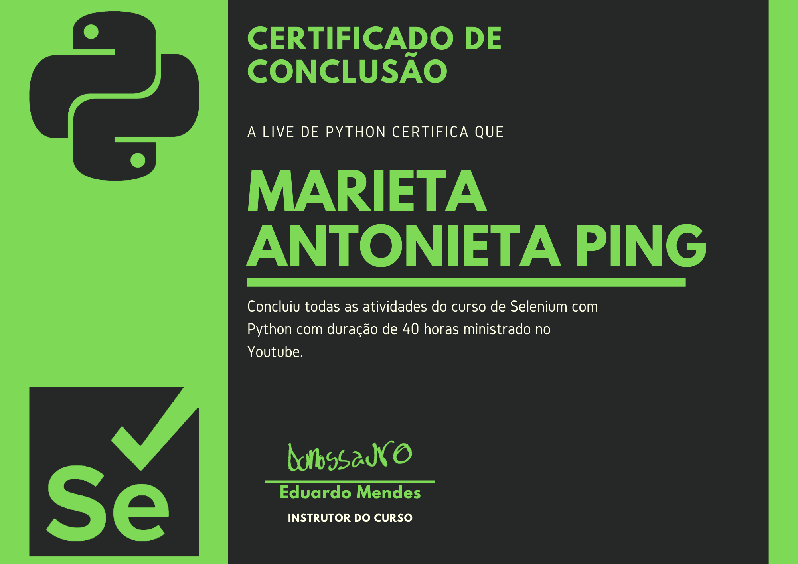

# Certificado



Aqui estão presentes as regras e os procedimentos para conseguir o certificado do curso de Python com Selenium.

> Antes de tudo, uma coisa tem que ficar clara, esse certificado não será emitido por nenhuma entidade certificadora. Ele é apenas uma recordação ou um sinal de que você teve brio para concluir as atividades do curso.

## Como vai ser?

Foi desenvolvida uma plataforma, com a mesma estética e as mesmas funcionalidades, que aprendemos e usamos durante o curso. Interação com elementos, eventos e navegação.

O objetivo dessa plataforma é exercitar todos, ou grande parte, dos conceitos aprendidos durante o curso e automatizar uma plataforma, pequena, de uma única vez. Com isso temos a ideia de uma progressão de todo conteúdo aprendido durante o curso.

A plataforma é uma mistura de um aplicativo de todo list com kanban. Para ter acesso ao kanban precisamos fazer o login na plataforma, consequentemente criar uma conta, e criar e movimentar tarefas.

O link da plataforma é esse: [PLATAFORMA](http://todo-brython.herokuapp.com/)

## Automações

As automações podem usar um framework de testes, caso você ache necessário, mas não é obrigatório. Os cenários podem ser escritos usando scripts simples mas que representem telas ou funcionalidades da aplicação, como você achar melhor.

A aplicação é composta por 3 telas:

1. Criação de conta
2. Login
3. Todo kanban

A ideia principal é que sejam criados 3 scripts (ou casos de teste) para automatizar os fluxos nas 3 telas diferentes.

Você pode escolher entre usar um wrapper de selenium que vimos durante as aulas, como selene ou splinter ou usar a biblioteca pura do selenium.

Mas tenha em mente que cenário ou "fluxo" não necessarimante é só sobre o caminho feliz. Para gente checar se o login está funcionando temos os eventos associados no formulário, a mensagem de erro e etc..

Fiz alguma descrição de cenários possíveis para você automatizar nesse documento [DOCUMENTO](cenarios_certificado.md)

### Regras

- É obrigatório o uso de Page Objects
- É obrigatório que seu projeto rode em mais de um browser
  - Você pode fazer isso da maneira que achar melhor usando grid, selenium-docker ou selenoid
  - Essa parte você pode documentar no seu README, caso não consiga reproduzir em código
- Independente da tecnologia que escolher para automatizar os arquivos de cada funcionalidade deve estar isolados. Por exemplo:
  - login.py
  - cadastro.py
  - todo.py
  - movimentacao_de_cartoes.py

### Dicas e sugestões

Eu adoraria ver vocês usando behave, embora não seja obrigatório, mas isso pode trazer muitos aprendizados. Mas seja uma pessoa pragmática, se achar que vai fluir melhor, use a ferramenta de sua escolha.

- Comente o código (isso vai ajudar todo mundo a aprender e contribuir no seu código)
- Seja descritivo, evite nomes com x, y ou abreviações sem necessidade

## Entrega

Para entregar, a única coisa que você precisa fazer é abrir uma issue nesse projeto com o link do seu repositório e o nome que quer que apareça no certificado.

Um exemplo de issue:

```
[Certificado] Marieta Antonieta Ping

Link do meu repositório: <link>
```

O certificado será respondido como imagem na issue e ela ficará para sempre no projeto, para que você fiquei registrado nele todas as pessoas que concluíram o curso.

## Até quando posso entregar?

Os certificados serão feitos até 04/11/2020 então pode relaxar e fazer no seu tempo livre


## Resultado esperado

O principal ponto aqui é tentar. Mesmo que você não consiga concluir o desafio, o certificado vai ser gerado, a ideia é fazer com que todo mundo pratique. Então não se preocupe com o código mais complexo e completo que conseguir. Apenas tente fazer o que acha que é possível.
